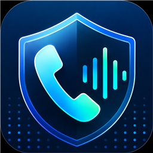
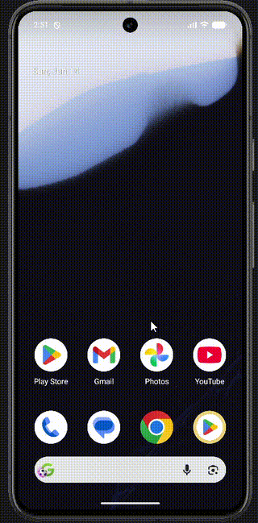

<p align="center">
  
</p>

<h1 align="center">GuardVoice</h1>

<p align="center">
  A consent-first Android app for preparing real-time AI scam call protection.
</p>

## Demo

<p align="center">
  
</p>

## Overview

GuardVoice is an Android prototype that reacts to incoming phone calls, asks for per-call consent, starts speakerphone plus microphone capture, and can stream approved call audio to Groq Whisper transcription for local scam-pattern analysis. The app guides users through the permissions required for call screening, displays a consent-focused call popup, and provides dashboard, summary, settings, account, and billing interfaces.

The long-term product goal is to route this through a production backend so API keys stay server-side and verdict history can sync across devices. The current client keeps call sessions local and never starts audio capture before the user gives per-call consent.

## Current Features

- Detects incoming phone calls through `CallScreeningService`
- Always allows calls through while showing a consent popup
- Starts speakerphone and microphone capture only after the user allows tracking
- Uses a transparent capture handoff activity so Android 14+ can start microphone capture from a visible app state
- Streams approved microphone audio in short WAV chunks to Groq Whisper when `GROQ_API_KEY` is configured
- Runs local scam-pattern analysis on returned transcripts and updates the live call popup
- Saves local SQLite call-session history with popup choice, capture status, streamed audio duration, transcripts, reasons, and verdicts
- Requests runtime phone-state, contacts, notification, and microphone permissions
- Guides users to grant overlay access and the Android Caller ID role
- Includes setup, dashboard, call popup, call summary, settings, account, and billing screens
- Provides Safe, Risky, and Scam presentation states in the popup and app history
- Includes unit tests for call-screening decisions, account validation, call audio stats, and scam analysis

> [!NOTE]
> GuardVoice is currently a prototype. Live Groq transcription and local scam analysis are wired for development, but production backend sync, production billing, and production authentication are not implemented yet.

## Technology

- Kotlin 2.2
- Jetpack Compose and Material 3
- Android `CallScreeningService`
- Android SQLite
- Groq speech-to-text API compatible with `whisper-large-v3` and `whisper-large-v3-turbo`
- Android SDK 36
- Minimum Android version: Android 10 (API 29)
- Java 17
- Gradle Kotlin DSL

## Getting Started

### Prerequisites

- Android Studio with Android SDK 36 installed
- JDK 17
- An Android 10+ device or emulator

### Build and Run

1. Clone the repository:

   ```bash
   git clone https://github.com/Riad374-code/VoiceGuard.git
   cd VoiceGuard
   ```

2. Open the project in Android Studio and allow Gradle to synchronize.

3. Run the `app` configuration on an Android 10+ device or emulator.

You can also build from the command line:

```powershell
.\gradlew.bat assembleDebug
```

On macOS or Linux:

```bash
./gradlew assembleDebug
```

The debug APK is generated under `app/build/outputs/apk/debug/`.

### Optional Groq Configuration

Live transcription is disabled unless a Groq key is supplied from an ignored local source. Add this to `.env` for local debug builds, or set the same values as environment variables before building. Gradle also accepts `local.properties` as a fallback.

```properties
GROQ_API_KEY=your_new_groq_key
GROQ_WHISPER_MODEL=whisper-large-v3-turbo
```

Do not commit API keys. For a production app, route transcription through a backend so the Groq key is never shipped inside the Android APK.

## Device Setup

On first launch, complete the setup checklist:

1. Grant microphone, phone state, contacts, and notification permissions.
2. Allow GuardVoice to display over other apps.
3. Set GuardVoice as the device's Caller ID and spam app when Android prompts you.

Call-screening behavior can vary by device manufacturer. Testing on a physical Android phone is recommended.

## Tests

Run the local unit tests with:

```powershell
.\gradlew.bat test
```

Or on macOS and Linux:

```bash
./gradlew test
```

## Project Structure

```text
app/src/main/
|-- AndroidManifest.xml
|-- kotlin/com/guardvoice/
|   |-- account/     # Account models and validation
|   |-- call/        # Incoming call screening
|   |-- data/        # Local call-session history
|   `-- ui/          # Compose app, screens, components, and theme
`-- res/
    |-- drawable/    # Popup and launch assets
    |-- layout/      # Call overlay layout
    `-- values/      # Strings and styles
```

## Planned Work

- Sync call summaries and prediction history with a production backend
- Move Groq calls behind a backend-held secret
- Replace prototype account and billing state with production services

## Privacy Direction

GuardVoice is designed around explicit consent:

- Incoming calls are allowed normally unless the user explicitly starts tracking.
- Every incoming call is allowed rather than silently blocked.
- Audio access is intended to start only after the user approves tracking for that call.
- Transcript and call-history storage should remain transparent and user-controlled.

For the detailed product and technical blueprint, see [`voice-guard-full-tech.md`](./voice-guard-full-tech.md).
